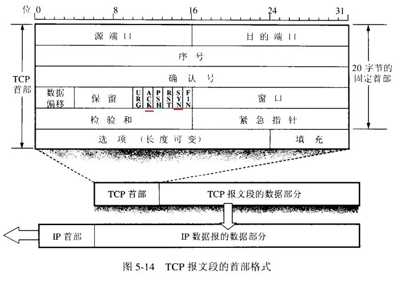
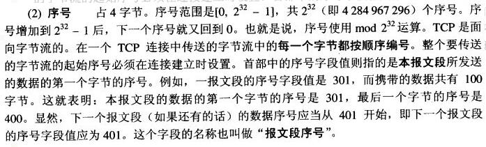
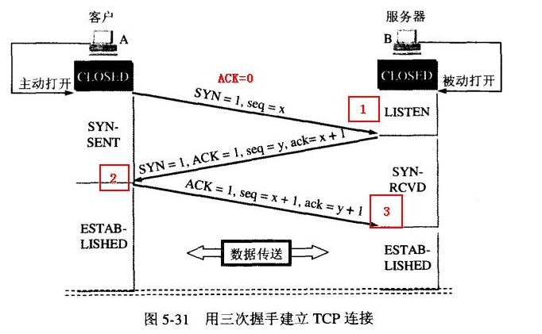
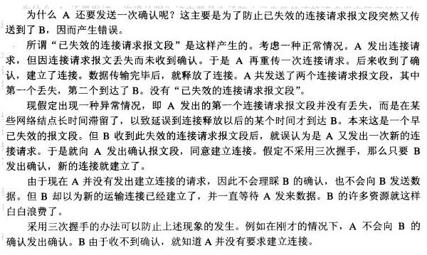
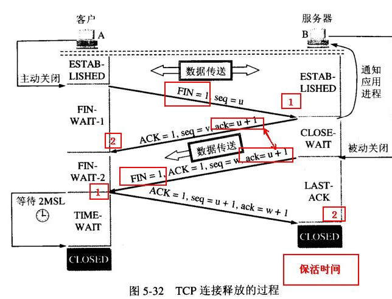
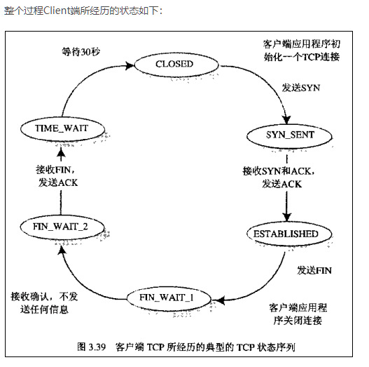
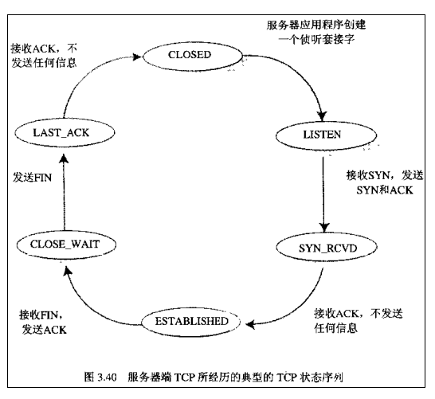

##TCP报文详解
[tcp参考资料](https://blog.csdn.net/daocaoren1543169565/article/details/80535949)

## 一、报文结构
### TCP头部：  
其中 SYN/ACK/FIN  和  Seq(序号)  这三个部分在以下会用到，它们的介绍也在下面

暂时需要的信息有：  
* SYN(Synchronization):   
在连接建立时用来同步序号。当SYN=1而ACK=0时，表明这是一个连接请求报文。  
对方若同意建立连接，则应在响应报文中使SYN=1和ACK=1. 因此,  SYN置1就表示这是一个连接请求或连接接受报文。  

* ACK(Acknowledge):   
TCP协议规定，只有ACK=1时有效，也规定连接建立后所有发送的报文的ACK必须为1  

* FIN （Finish）:  
即完，终结的意思， 用来释放一个连接。当 FIN = 1 时，表明此报文段的发送方的数据已经发送完毕，并要求释放连接。
    
 
* SEQ (Sequence 序号)：  

## 二、通信流程
### 建立连接，三次握手的过程:

>> 流程描述  
1)首先由Client发出请求连接即 SYN=1 ACK=0   
2)(请看头字段的介绍), TCP规定SYN=1时不能携带数据，但要消耗一个序号,因此声明自己的序号是 seq=x
然后 Server 进行回复确认，即 SYN=1 ACK=1 seq=y, ack=x+1,  
3)再然后 Client 再进行一次确认，但不用SYN 了，这时即为 ACK=1, seq=x+1, ack=y+1.

###  连接建立，为什么要进行三次握手呢?（两次确认）

###   释放连接，四次挥手的过程：

>> 流程描述  
当客户A 没有东西要发送时就要释放 A 这边的连接，
A会发送一个报文（没有数据），其中 FIN 设置为1,  
服务器B收到后会给应用程序一个回信，这时A那边的连接已经关闭，即A不再发送信息（但仍可接收信息）。
A收到B的确认后进入等待状态，等待B请求释放连接，
B数据发送完成后就向A请求连接释放，也是用FIN=1 表示， 并且用 ack = u+1(如图）， 
A收到后回复一个确认信息，并进入 TIME_WAIT 状态， 等待 2MSL 时间。

>> 为什么要等待呢？  
为了这种情况：
B向A发送 FIN = 1 的释放连接请求，但这个报文丢失了， A没有接到不会发送确认信息， B 超时会重传，
这时A在 WAIT_TIME 还能够接收到这个请求，这时再回复一个确认就行了。
A收到 FIN = 1 的请求后 WAIT_TIME会重新记时） 
另外服务器B存在一个保活状态，即如果A突然故障死机了，
那B那边的连接资源什么时候能释放呢？  
就是保活时间到了后，B会发送探测信息， 以决定是否释放连接。
 
>> 【注意】中断连接端可以是Client端，也可以是Server端。  
假设Client端发起中断连接请求，也就是发送FIN报文。
Server端接到FIN报文后，意思是说"我Client端没有数据要发给你了"，
但是如果你还有数据没有发送完成，则不必急着关闭Socket，可以继续发送数据。
所以你先发送ACK，"告诉Client端，你的请求我收到了，但是我还没准备好，
请继续你等我的消息"。这个时候Client端就进入FIN_WAIT状态，继续等待Server端的FIN报文。
当Server端确定数据已发送完成，则向Client端发送FIN报文，"告诉Client端，好了，我这边数据发完了，准备好关闭连接了"。
Client端收到FIN报文后，"就知道可以关闭连接了，但是他还是不相信网络，
怕Server端不知道要关闭，所以发送ACK后进入TIME_WAIT状态，
如果Server端没有收到ACK则可以重传。“，Server端收到ACK后，"就知道可以断开连接了"。
Client端等待了2MSL后依然没有收到回复，则证明Server端已正常关闭。那好，我Client端也可以关闭连接了。
Ok，TCP连接就这样关闭了！
 
### 整体流程梳理
* 整个过程Client端所经历的状态如下  

 
* Server端所经历的过程如下   

>> 【注意】 在TIME_WAIT状态中，如果TCP client端最后一次发送的ACK丢失了，它将重新发送。
TIME_WAIT状态中所需要的时间是依赖于实现方法的。
典型的值为30秒、1分钟和2分钟。
等待之后连接正式关闭，并且所有的资源(包括端口号)都被释放。

## 三、面试答疑
>> 【问题1】为什么连接的时候是三次握手，关闭的时候却是四次握手？  
答：因为当Server端收到Client端的SYN连接请求报文后，可以直接发送SYN+ACK报文。
其中ACK报文是用来应答的，SYN报文是用来同步的。
但是关闭连接时，当Server端收到FIN报文时，很可能并不会立即关闭SOCKET，
所以只能先回复一个ACK报文，告诉Client端，"你发的FIN报文我收到了"。
只有等到我Server端所有的报文都发送完了，我才能发送FIN报文，因此不能一起发送。故需要四步握手。

>> 【问题2】为什么TIME_WAIT状态需要经过2MSL(最大报文段生存时间)才能返回到CLOSE状态？  
答：虽然按道理，四个报文都发送完毕，我们可以直接进入CLOSE状态了，但是我们必须假象网络是不可靠的，
有可以最后一个ACK丢失。所以TIME_WAIT状态就是用来重发可能丢失的ACK报文。